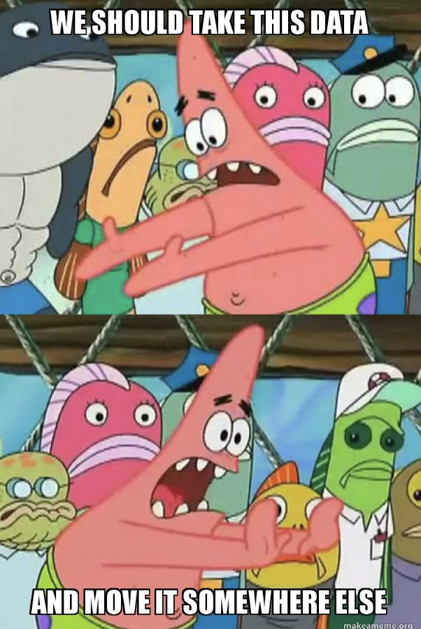

# Journal — 2025-10-04 — DAY 7

## 1) What I learned (bullets, not prose)
- DEs do not delete or edit raw tables.
- But they can create new columns and new tables, and make sure to prioritize numbers/IDs for the back-end.
- When creating an end-to-end pipeline, duplicate the subfolders, **not** create from scratch!!
- Important to know the trade-offs because the DE makes the trade-off.
- Business questions: make money, save money, compliance
- Quality <> just accuracy: Accuracy, Completeness, Reading, Relevancy, Timeliness
- Trust = accuracy * transparency * timeliness
- Checking of values should be conducted more than once, for the architecture, may be best during Transform (Clean) and Mart. Every time you move the data is more accurate.
- OULAD Dataset
    * 
    *  
    * 
    * Volume/Completeness: row counts table per course/day 
    * Nulls/Requiredness: critical dimensions populated 
    * Referential inegrity: id_assessment exists in assignments 
- Maturity Model
    * Level 1: SQL checks + simple alerts 
    * Leve2: Config runner + log table
    * Level 3 : dbt tests & orchestration + lineage
    * Level 4: Full observability platoform
- Always best practice to data type cast.

## 2) New vocabulary (define in your own words)
- **Procurement** - when you buy something, e.g. materials, equipment
- **KYC** - Know your customer
-  **DQ Contract** - business process where an agreement is created with the business for what they require, the thresholds, the SLA or turnaround time, and the owner. including "Warn vs Fail" policy, and quaratntine bad partitions
- **Service Level Agreement (SLA)** - contract that outlines the level of service a provider must meet

## 3) Data Engineering mindset applied (what principles did I use?)
- 

## 4) Decisions & assumptions (why, alternatives, trade-offs)
- For an example exercise, I did X, because of Y

## 5) Open questions (things I still don’t get)
- 

## 6) Next actions (small, doable steps)
- [ ] 

## 7) Artifacts & links (code, queries, dashboards)
- 

---

### Mini reflection (3–5 sentences)
What surprised me? What would I do differently next time? What will I watch out for in production?

### BONUS: What is a meme that best describes what you feel or your learning today?

