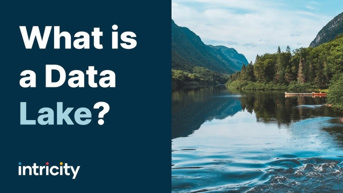

# Journal — 2025-10-11 — DAY 8

## 1) What I learned (bullets, not prose)
- Data in the Wild: Data Collection
- Data is a representation of the real world
- Data Lifecycle: Data Generation (Reality) → Measurement/A number (Representation) → Data Cleaning & Transormation (Processing) → Answering Business Question (Action)
- Data as Different Shapes: Tabular, Hierarchical, Graph, Time Series, Geospatial
- Build things to last
- 

## 2) New vocabulary (define in your own words)
- **Pandas** - used to read and write small-scale file formats
- **Ibis** — used to connect to databases, based on Python
- **Interface** - general tools other users maybe able to use even without knowing exactly how it works
- 

## 3) Data Engineering mindset applied (what principles did I use?)
- Move data once!

## 4) Decisions & assumptions (why, alternatives, trade-offs)
- For an example exercise, I did X, because of Y

## 5) Open questions (things I still don’t get)
- huhuhu, what is a data lake?

## 6) Next actions (small, doable steps)
- [ ] study git

## 7) Artifacts & links (code, queries, dashboards)
- https://dataengineering.ph/

---

### Mini reflection (3–5 sentences)
What surprised me? What would I do differently next time? What will I watch out for in production?

I'm surprised at how cool git is!

### BONUS: What is a meme that best describes what you feel or your learning today?

